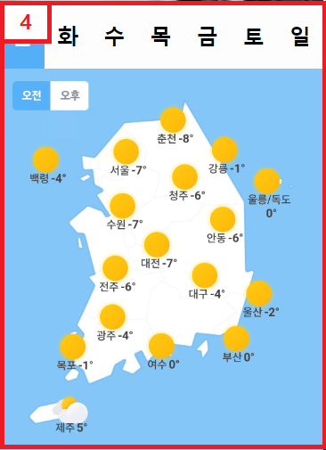
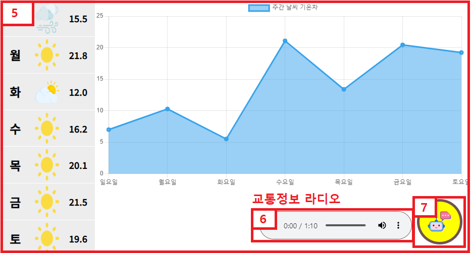

# 전국 날씨
##### 바쁜 현대인의 아침 출근길 시간대별 상세 날씨 정보와 일주일의 날씨에 대한 정보를 제공하는 것이 목표.
---

## 요일별 전국 날씨 지도


#### 목표
- 요일별로 전국 날씨 현황을 확인할 수 있다.  
- 오전/오후로 나눠 시간대별 전국 날씨 현황을 확인할 수 있다.
   
```js
function weather_setImageSrc(day,time){
    // day : 월화수목금토일 | time : 오전,오후
    $('#weather_koreaImg').attr('src',`src/전국날씨_${day}_${time}.jpg`)
}
```
  
#### 코드설명  
###### 요일 & 오전/오후의 버튼클릭으로 이미지 변경이 가능.
---

## 오늘의 날씨 정보


#### 목표
- 오늘의 날씨 정보를 뉴스 영상으로 시청이 가능하다.
  
##### 코드 공간  
---

## 요일별 기온 정보 트래픽


#### 목표
- 요일별, 날씨 주간 기온차를 그래프로 통해 한눈에 확인이 가능하다.
  
```js
const weatherChartData = {
    '맑음': [8, 10, 'src/brightness.png'],
    '흐림': [5, 7, 'src/sun.png'],
    '비': [3, 6, "src/rain.png"],
    '눈': [-3, 5, "src/snow.png"],
    '바람': [4, 5, "src/wind.png"]
}
// 범위 내 랜덤 숫자 뽑기
function getRandomInterval(min, max) { 
  return Math.random() * (max - min) + min;
}
// 임의의 날짜 뽑기
function getRandomWeather() { // 
      const keys = Object.keys(weatherChartData)
      return weatherChartData[keys[Math.floor(getRandomInterval(0, keys.length))]]
  }
// 업데이트
function updateTempByRendom() {
    weaterChartData = []
    for (let i = 1; i < 8; i++) {
        const [minTemp, maxTemp, ImgSrc] = getRandomWeather();

        let randTemp = getRandomInterval(minTemp, maxTemp).toFixed(1);
        weaterChartData.push(randTemp);

        // 이미지 잡기
        $(`#wcTitle > div:nth-child(${i}) > img`).attr('src', ImgSrc)

        // 기온 잡기
        $(`#wcTitle > div:nth-child(${i}) > div.wcTemp`).text(randTemp)

    }
    tempChart.data.datasets[0].data = weaterChartData;
    tempChart.update();
}
```

#### 코드설명
###### 랜덤한 값으로 요일별 기온차를 확인할 수 있다.  
---

# 작업일지

### 날씨정보 섹션
날씨정보 관련된 이미지를 등록하는 위치입니다.  
이미지 작업이 끝난 후에는, common > src 경로에도 파일을 복사해주세요.

## 기능 명세
### 전국날씨 요일별 오전 오후 날씨
- [x] 이미지 리소스 확보 (1/12)  - 김인수
- [x] 전국날씨 UI 초안 작성 (1/12) - 김인수
- [ ] 이미지 리소스 변경 함수 개발 (1/15) - 박원빈
- [ ] 요일별 오전 오후 버튼에 이미지 변경 이벤트 등록 (1/15) - 김인수
- [ ] 버튼 위치 및 CSS 적당히 편집 (1/15)
- [ ] ...필요 시 날씨 영역 추가 기획
- [ ] ...(시간 남으면) HTML 구조 전체를 JS/JQuery 로 생성하도록 고도화

### 메인 레이아웃
- [x] 목업 페이지 초안 작성 (1/12) - 김은지
- [x] 로고 및 네비게이션 메뉴 추가 (1/12) - 김은지
- [x] 공통 CSS 초안 작성 (1/12) - 김은지
- [ ] index 디자인 구체화 CSS/JS (1/15) - 김은지
- [ ] ... 필요 시 index 영역 추가 기획


### 기타 (미확정 사항)
- [ ] BGM on/off
- [ ] 외부 링크 열기(JS/JQuery로 HTML생성)
- [ ] 랜덤 날씨 동영상(유튜브) 끌어와서 틀기
